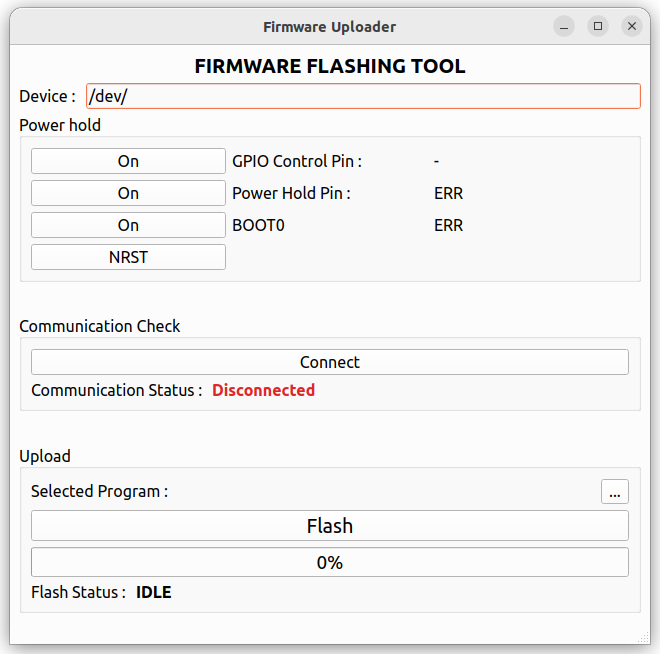

# firmware_uploader

<p align="center">
  
</p>


### Install Dependencies
```
cd firmware_uploader/shell
```
```
./install.sh
```

### Quick Start

```
cd firmware_uploader/shell
```

**GUI 모드 (기본)**
```
./run_script.sh
```

**Headless 모드 (TUI)**
```
./run_script.sh --headless
```

옵션:
- `--headless`, `-H` : GUI 없이 5단계 TUI로 진행 (Bootloader 진입 → Connect → BIN 경로 → Flash → Bootloader 종료)
- `--port <device>` : 시리얼 포트 지정 (기본 `/dev/ttyS0`)

예시:
```
./run_script.sh --headless --port /dev/ttyS0
```